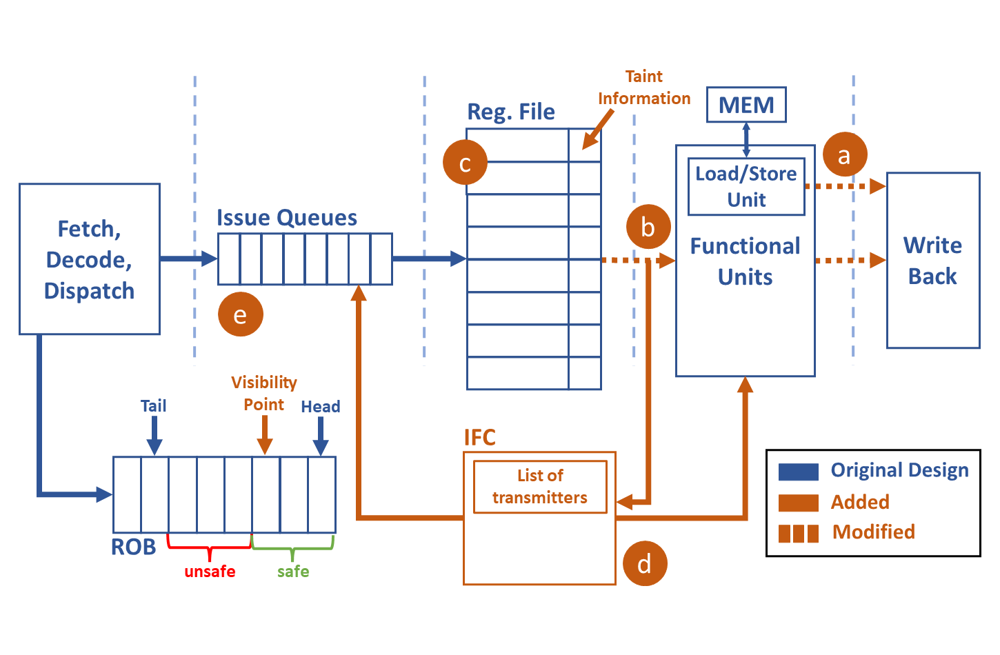

# Secure-by-Construction Design Methodology for CPUs: Implementing Secure Speculation on the RTL

Ever since the Spectre and Meltdown attacks proved Transient Execution Side Channels to be a fundamental vulnerability of modern processors, secure microarchitecture design is a challenge considered urgent by chipmakers. Various countermeasures against these threats were proposed on the electronic system level. However, addressing all possible attack scenarios requires the design and analysis of bit- and cycle-accurate implementations. 

In our paper [Secure-by-Construction Design Methodology for CPUs: Implementing Secure Speculation on the RTL](https://www.uni-kl.de)[^1], we present a novel secure-by-construction RTL design methodology based on a generic information flow tracking infrastructure. The methodology uses formal verification to systematically detect possible leakage paths and to customize the generic infrastructure accordingly for the design. We propose an iterative flow that semi-automatically leads to an RTL design that is **guaranteed to be secure w.r.t. transient execution attacks**. A case study for the methodology is conducted on BOOMv3, an open-source RISC-V processor with a deep out-of-order pipeline, and the resulting secure RTL design is benchmarked on an FPGA setup. Our design outperforms a design based on conservative countermeasures, improving the incurred overhead by 3X / 4X (depending on the threat model) while maintaining the same level of security. 

## The Berkeley Out-of-Order RISC-V Processor

The [Berkeley Out-of-Order Machine (BOOM)](https://github.com/riscv-boom/riscv-boom) is an open-source superscalar out-of-order core, designed and maintained by [UC Berkeley Architecture Research](https://bar.eecs.berkeley.edu/). The core's third major release, implements the RV64GC variant of the RISC-V ISA. The current version of the BOOM microarchitecture ([SonicBOOM, or BOOMv3](https://carrv.github.io/2020/papers/CARRV2020_paper_15_Zhao.pdf)) is performance competitive with commercial high-performance out-of-order cores, achieving 6.2 CoreMarks/MHz.

Spectre-style attacks are possible in BOOMv3 and no mitigation has been implemented yet. With respect to Meltdown, measures have been taken in BOOMv2 to prevent this kind of attack, but have been reintroduced to the microarchitecture as we could show in the course of this work.

## Threat Model

Our approach is based on the commonly used threat model for transient execution side channels. The security target is preventing any transient execution side channel from leaking the content of data memory. 

This threat model assumes an attacker that can measure the timing of instruction execution with clock cycle accuracy, including the timing of the victim software execution. The victim process has sufficient privilege to access secret data and may transiently execute any instruction outside its correct program flow and later discard the results. The attacker can poison the predictors in order to trick the victim process into executing a specific gadget. This threat model includes any TES attack based on any microarchitectural side channel such as cache side channels, port contention, and data-dependent timing in functional units. 

For this threat model, we may assume that the victim does not leak its protected data in the correct program flow under sequential semantics. Hence, preventing attacks enabled by classical side channel analysis, e.g., monitoring the instruction cache footprint of square-and-multiply exponentiation in RSA is not considered in this paper.  

Our threat model protects data that resides in the data memory (\emph{data-at-rest}), while any information in general-purpose or control status registers is considered non-confidential. Storing confidential information in the architectural registers must be handled responsibly by the software developer. Physical side channels, such as power or electromagnetic side channels, are also out of the scope of this paper. 

To allow for a trade-off between performance and security, we distinguish between two different threat models: *spectre* and *futuristic*. 
The *spectre model* covers timing side channels caused by control-flow mispredictions, i.e., it only considers instructions after unresolved branch or jump instructions and neglects any other form of transient execution. The *futuristic model* extends this to all kinds of transient execution and includes prior exceptions, memory consistency model violations, and load/store ordering
failures. Such a distinction is helpful for the designer since the *spectre* model already covers the majority of known Spectre variants and prevents universal read gadgets. Additionally, it allows the microarchitecture to benefit more from out-of-order execution. 

## SecureBOOM

In this work, we address the challenge of designing secure microarchitectures by a new hardware framework with a generic control infrastructure which is systematically customized in a secure-by-construction design flow to achieve the defined security targets. The proposed flow is an iterative procedure that interleaves design steps with formal verification to create security countermeasures against TES attacks in a semi-automated way. Our design and verification flow pinpoints security issues at the design phase and enables the designer to implement targeted security
countermeasures rather than conservative and expensive blanket fixes. 

The proposed approach utilizes a generic dynamic information flow tracking infrastructure to detect the flow of information from transiently accessed data, similar to secure speculation approaches such as Speculative Taint Tracking [^5] and DOLMA [^6]. The information flow policy, i.e., when to block the propagation of tainted information is determined based on a formal analysis of the microarchitecture. It replaces the error-prone manual analysis required to implement the existing secure speculation schemes. The formal analysis at the core of the design flow is performed by Unique Program Execution Checking (UPEC) [^2] which identifies TES vulnerabilities in the RTL design. The proposed systematic design flow provides an end product with a well-defined formal security guarantee. More importantly, the formal guarantee enables the designer to adopt more aggressive optimizations without the risk of compromising security because any security violation is guaranteed to be detected in the design flow.

### Generic Control Infrastructure for Security

The figure shows how our methodology augments a standard out-of-order execution pipeline with a generic control infrastructure for security. It consists of a generic tainting infrastructure and an
information flow controller (IFC).

#### Generic Tainting Infrastructure

Every register in the general-purpose register file is instrumented with an additional field for taint information. In-flight instructions in the execute stage have an additional attribute for the taint information regarding their destination register. This information includes a single bit denoting the taint which is set and cleared based on taint and untaint rules. These rules rely on the *visibility point* in the ROB, which is defined as the youngest non-speculative instruction, depending on the threat model. 

An unsafe load instruction, i.e., a load instruction that lies between the visibility point and the Re-Order Buffer (ROB) tail, taints its destination register in the register file. Subsequently, any instruction that has a tainted operand sets the taint bit for its destination register. Based on the taint rules, the effect of speculatively accessed data is tracked across the pipeline over the course of instruction execution. For minimum performance penalty, the output of speculative load instructions must be untainted as soon as they are proven non-transient, i.e., when they pass the visibility point in the ROB. This can be challenging to implement, as retracing instruction dependencies through the ROB is difficult. Tracking the youngest root of taint (YRoT), i.e., the youngest instruction that initiated the taint bit, simplifies this problem by removing the chaining of dependencies. 

Therefore, the taint information of the register file and of in-flight instructions also have a field that stores an identifier pointing to the YRoT. This identifier, for example, can be the index of the ROB entry for the corresponding instruction. In the case of a load instruction, the YRoT of the destination register is set to the identifier of the load instruction itself. For any other instruction, the YRoT of the destination register is set as the youngest YRoT among the tainted operands. Using the YRoTs, the register file clears the taint bit of any register as soon as its YRoT points to a safe instruction. It should be noted that in this paradigm, the data memory does not need to be tainted manually since any transient memory access is considered confidential information until the load instruction becomes non-transient. 

#### Information Flow Controller

The proposed information flow controller (IFC) selectively inhibits the execution of certain in-flight instructions without stalling the entire pipeline. Its generic structure enables the designer to implement it without any security knowledge. Our iterative design methodology (described in the following section) utilizes the IFC to implement information flow policies in a semi-automated way. This completely relieves the designer from having an in-depth understanding of TES and their microarchitectural implications. 

The IFC receives the opcode, ROB index, and taint information of the in-flight instruction in every functional unit. It is equipped with a list of transmitters, i.e., instructions capable of forming a side channel. During runtime, if there is any tainted in-flight transmit instruction, the IFC sends a *kill* signal to the corresponding functional unit to prevent the execution of the transmitter. The IFC also notifies the issue queue with a *wait* signal and sends the necessary information to re-issue the instruction if it becomes safe. The designer does not need to set up the list of transmitters manually and only needs to implement the IFC with an empty list. The list will then be generated and refined through the iterative design methodology by formal analysis. 

In the case of functional units with multi-cycle execution, the IFC kills transmit instructions at the beginning of the execution phase. Therefore, there is no need to incorporate complex logic to abort multi-cycle operations in the middle of their execution. This significantly simplifies the integration of the IFC into the pipeline. In the unlikely event that transmitters exist that leak prior to the execution stage, we rely on the exhaustive analysis of UPEC to detect them. In this case, a local fix can be applied. 
 
The issue queue processes the *wait* command from the IFC. Each issue slot compares the ROB index of its instruction with the ROB index of the instruction killed by the IFC. If they match, the slot saves the YRoT that corresponds to this instruction and goes to the WAIT state. As soon as the YRoT becomes safe, the slot goes back to the READY state and re-issues the instruction according to the existing scheduling logic. 

It should be noted that the design flow is inherently robust against design mistakes in the infrastructure. The UPEC formal analysis discovers any bug in the introduced design instrumentation. 
 
Unlike mitigations proposed in the literature which require a security engineer to integrate patches across a complex pipeline, our approach creates a generic and centralized security infrastructure. Designing this infrastructure does not require any in-depth security knowledge since only the implementation of the *visibility point* depends on the threat model. 
Therefore, it creates a separation of concerns by decoupling the tool-based security analysis from the manual design tasks which are straightforward.

### Iterative Secure-by-Construction Design Flow

The figure above shows the proposed iterative design flow for the secure-by-construction methodology. The basic idea is to interleave formal security verification by UPEC with the design steps and iteratively verify and patch the design. In each iteration, UPEC pinpoints a vulnerability by producing an execution trace that exposes a microarchitectural timing side channel. The trace points to a transmit instruction whose opcode is then added to the list of transmitters in the IFC. Through these iterations, the list of transmitters in the IFC is refined in a semi-automatic 
way such that the IFC blocks any instruction leaking tainted data. In the last iteration, UPEC certifies the design to be secure w.r.t. the threat model. This flow yields a secure design that removes the need for a separate verification flow. 

The starting point of the methodology is the RTL implementation of an out-of-order microarchitecture (Box II). The designer needs to select the desired threat model w.r.t.\ TES attacks (Box III), as described in the threat model. The RTL implementation is then instrumented with the generic control infrastructure for security (Box I), according to the presented IFT infrastructure. The list of transmitters in the IFC is initially empty and the IFC does not stall any instructions. The threat model is also used to refine the UPEC property. 

The iterative design flow begins with verifying the initial design with UPEC (Box IV). The proof, most likely, points to a TES vulnerability and shows an execution trace describing the propagation and leakage of the secret from the memory to the architectural registers. The trace consists of a sequence of instructions that use transiently accessed data. The designer now needs to identify the instruction being the culprit for the side channel. This is easy because the SAT solver always finds the shortest possible trace as a counterexample and therefore, the sequence does not contain any irrelevant instructions. Any instruction after the transient load is crucial for the side channel and blocking it breaks the propagation chain. In the majority of cases, selecting the first instruction right after the transient load is sufficient. Once the transmitter has been identified, its opcode is added to the list of transmitters in the IFC (Box V). 

In some cases, the designer may conclude from the counterexample that a local patch can achieve security without performance overhead (Box VI). For example, if the side channel exists due to specific RTL design decisions or even design bugs, reverting these decisions may remove the side channel without impacting performance. Furthermore, the formal analysis also points out any mistake in the implementation of the generic control infrastructure for security. It is easy to identify counterexamples pointing to such a bug because the counterexample will show a trace with a transmit instruction that is already in the list of transmitters. Such an execution trace indicates that the taint propagation is not implemented properly or the IFC is not integrated correctly.  

Once the detected gap is patched, the design is re-verified. This process is continued until the solver can no longer produce a counterexample and therefore certifies the design to be secure w.r.t. the threat model (Box VII). 

Thanks to the exhaustive proofs of UPEC, the final design does not miss any side channel, even previously unknown ones. Furthermore, since the counterexamples only point to the instructions
that are absolutely necessary for forming a side channel, the design avoids blanket fixes and unnecessary performance overheads. The process completely relieves the designer from any
*a priori* knowledge about side channels and prevents any mistakes due to misunderstanding the counterexamples. For example, if the designer selects the wrong instruction as a transmitter, this will be detected since the UPEC proof will return the same counterexample in the next iteration. More importantly, the UPEC property is agnostic to the underlying information flow infrastructure and therefore detects any bug in this part of the design that can lead to information leakage. This is crucial for designing a secure microarchitecture, since, as our case study shows, implementing information flow tracking schemes can be prone to design errors. 

The main advantage of the proposed flow lies in the fact that it enables designers to embark on more aggressive optimizations without risking the security of the design. The final product has been benchmarked using simulation / FPGA emulation (Box VIII) and the designer could now optimize different parts of the design to achieve the desired performance. Any such design update within or after the iterative flow is checked by UPEC to evaluate the security implications of the optimizations. This is particularly important for out-of-order microarchitectures, where designers need to employ a variety of techniques to increase throughput while minimizing the critical path of the design. 

### Case Study

To show the feasibility of our design methodology, we present proof-of-concept mitigation of all TES vulnerabilities according to the threat models previously. This repository contains a case study of the proposed design flow, conducted on BOOMv3, in which we developed a secure RTL implementation. The secure design delivers an average performance overhead of 5.2 % and 36.0 % compared to the insecure baseline design, depending on the threat model. Our case study shows that RTL design details can create timing variations that are not visible in the more abstract models. Therefore, a systematic methodology based on cycle- and bit-accurate models is necessary. 

The implemented design, to the best of our knowledge, is the first formally verified RTL hardware implementation of a processor featuring secure speculation with competitive performance. The design is capable of running a Linux operating system and is comparable to medium-sized application processors used in the industry. The formal guarantees for our implementation are provided by Unique Program Execution Checking.

## Unique Program Execution Checking (UPEC)

UPEC (Unique Program Execution Checking) is a formal approach for detecting vulnerabilities to transient execution attacks in out-of-order processors. This technique has been developed by the [Electronic Design Automation Group](https://www.eit.uni-kl.de/eis/research/) at RPTU in Kaiserslautern, Germany.

The verification suite that can be used to verify the BOOM design against transient execution attacks and further information on the functionality can be found [here](https://github.com/RPTU-EIS/upec-boom-verification-suite).

A more detailed description of the employed formal verification technique can be found in: 
- "An Exhaustive Approach to Detecting Transient Execution Side Channels in RTL Designs of Processors" [^2]
- "A formal approach for detecting vulnerabilities to transient execution attacks in out-of-order processors" [^3]
- "Processor hardware security vulnerabilities and their detection by unique program execution checking" [^4]

[^1]: T. Jauch, A. Wezel, M. R. Fadiheh, P. Schmitz, S. Ray, J. M. Fung, C. W. Fletcher, D. Stoffel, W. Kunz:
[Secure-by-Construction Design Methodology for CPUs: Implementing Secure Speculation on the RTL](https://www.uni-kl.de).
In 2023 IEEE/ACM International Conference On Computer Aided Design (ICCAD) (to appear).

[^2]: M. R. Fadiheh, A. Wezel, J. Mueller, J. Bormann, S. Ray, J. Fung, S. Mitra, D. Stoffel, W. Kunz: 
[An Exhaustive Approach to Detecting Transient Execution Side Channels in RTL Designs of Processors](https://ieeexplore.ieee.org/abstract/document/9716812). 
In IEEE Transactions on Computers (Volume: 72, Issue: 1), January 2023

[^3]: M. R. Fadiheh, J. Müller, R. Brinkmann, S. Mitra, D. Stoffel, W. Kunz:
[A formal approach for detecting vulnerabilities to transient execution attacks in out-of-order processors](https://ieeexplore.ieee.org/document/9218572). 
In 2020 57th ACM/IEEE Design Automation Conference (DAC) (pp. 1-6). IEEE.

[^4]: M. R. Fadiheh, D. Stoffel, C. Barrett, S. Mitra, W. Kunz:
[Processor hardware security vulnerabilities and their detection by unique program execution checking](https://ieeexplore.ieee.org/abstract/document/8715004). 
In 2019 Design, Automation & Test in Europe Conference & Exhibition (DATE) (pp. 994-999). IEEE.

[^5]: J. Yu, M. Yan, A. Khyzha, A. Morrison, J. Torrellas, C. W. Fletcher:
Speculative Taint Tracking (STT): A Comprehensive Protection for Speculatively Accessed Data. 
In 2019 52nd Annual IEEE/ACM Intl. Symposium on Microarchitecture (pp. 954–968). IEEE.

[^6]: K. Loughlin, I. Neal, J. Ma, E. Tsai, O. Weisse, S. Narayanasamy, B. Kasikci:
DOLMA: Securing speculation with the principle of transient non-observability.
In 30th USENIX Security Symposium, 2021
